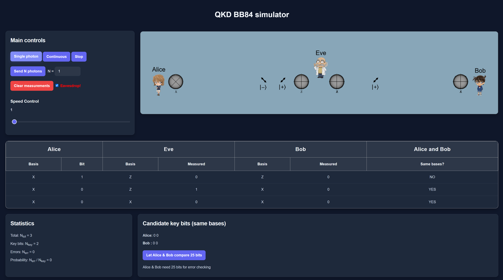

<p align="center">
    
</p>
<p align="center"><h1 align="center">QKD BB84 Simulator</h1></p>

<p align="center">Built with the tools and technologies:</p>
<p align="center">
	
	
	
	

	
</p>
<br>


##  Overview

This simulator was built as project for [COE466](https://faculty.kfupm.edu.sa/COE/mfelemban/COE466/241/index.html) course at KFUPM.
It provides a simulation of the [BB84](https://en.wikipedia.org/wiki/BB84#:~:text=BB84%20is%20a%20quantum%20key,the%20first%20quantum%20cryptography%20protocol.) QKD protocol, which is a foundational quantum cryptography method for securely distributing encryption keys between two parties. The simulator demonstrates the principles of quantum key distribution and allows users to explore the mechanics of the BB84 protocol.

#### Go & Try it!
- https://ali-makky.github.io/QKD_BB84/
---

##  Features

- Simulation of the BB84 protocol steps, including:
  - Preparation and transmission of quantum bits (qubits)
  - Measurement of qubits with random bases
- Visualization of the quantum states and measurement outcomes
- Key validation process to generate a shared secret key, and discover potential eavesdropping
 
---

##  Project Structure

```sh
└── QKD_BB84/
    ├── index.html
    ├── package.json
    ├── public
    │   ├── img/
    │   └── style.css
    ├── src
    │   ├── backend/
    │   ├── frontend/
    │   └── main.js
    └── vite.config.js
```


---
##  Getting Started
To run the simulator locally, follow these steps:


###  Installation

1. **Clone the QKD_BB84 repository:**
```sh
❯ git clone https://github.com/Ali-Makky/QKD_BB84.git
```

2. **Navigate to the project directory:**
```sh
❯ cd QKD_BB84
```

3. **Install the project dependencies:**
```sh
❯ npm install
```


###  Usage
Run QKD_BB84 using the following command:

```sh
❯ npx vite
```
Open your browser and navigate to `http://localhost:<prot-number>` to access the simulator.

---

##  License

This project is under the **MIT** License. For more details, refer to the [LICENSE](https://choosealicense.com/licenses/mit/) file.

---

##  Acknowledgments

- This project draws inspiration from [QuVis](https://www.st-andrews.ac.uk/physics/quvis/simulations_html5/sims/BB84_photons/BB84_photons.html) and includes some enhancements.

---
